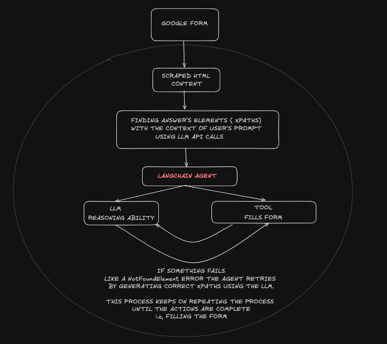

## Description  
An agent that could fill a google form based on given user's context.
More specifically a langchain ReAct agent that uses custom Selenium functions/tools to fill a form.   
  


## Architecture Flow Chart
    


## Frameworks/Tools used   
-Langchain - for building tool calling agents.     
-Selenium  - for custom functions that could fill,scroll and click on browser elemtents.   
  


## Installation  and Seup
1.clone repo  
```
git clone https://github.com/adithya04dev/FormPilot.git  
```
2.create environment and activate  
```
python -m venv venv    
cd venv    
.\venv\scripts\activate   
```
3.install requirements  
```
pip install - r requirements.txt   
```
4. set gemini,openai api key in .env file
5. Run streamlit app 
```  
streamlit run app.py  
```


